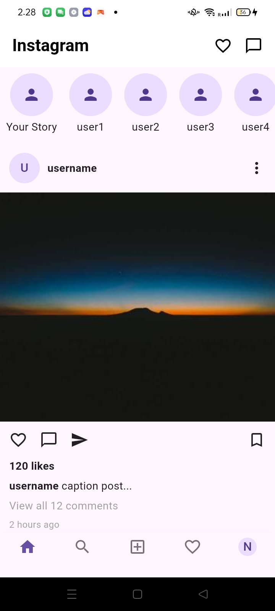
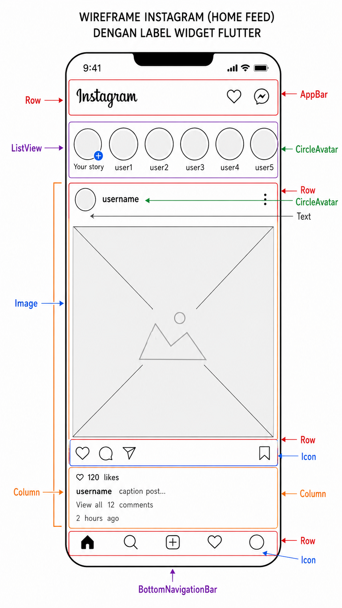

# Tugas UI/UX Flutter — Instagram

## Identitas

- **Nama:** Nanda Syalwa Nazella
- **NIM:** 2455201110016
- **Pilihan:** B (Instagram)

---

## Deskripsi Singkat

Pada tugas ini saya membuat tampilan UI Instagram Home Feed menggunakan Flutter.

Halaman yang dibuat terdiri dari:

- AppBar Instagram
- Stories Section
- 1 Post Feed
- Action Button (like, comment, share, bookmark)
- Bottom Navigation Bar

Tampilan dibuat berdasarkan wireframe yang telah dirancang sebelumnya menggunakan Figma.

---

## Widget yang Digunakan

| Widget              | Fungsi                            |
| ------------------- | --------------------------------- |
| Scaffold            | Struktur utama halaman            |
| AppBar              | Header aplikasi                   |
| Column              | Menyusun widget secara vertikal   |
| Row                 | Menyusun widget secara horizontal |
| ListView            | Membuat stories horizontal        |
| CircleAvatar        | Menampilkan avatar/profile        |
| Image.network       | Menampilkan gambar post           |
| Container           | Membungkus layout                 |
| Padding             | Memberi jarak antar widget        |
| SizedBox            | Memberi spacing                   |
| Icon                | Menampilkan ikon                  |
| Text                | Menampilkan teks                  |
| BottomNavigationBar | Navigasi bawah aplikasi           |

---

## Screenshot

---

## Wireframe

---

## Kesulitan yang Ditemui

Beberapa kesulitan yang ditemui selama pengerjaan tugas:

- Memahami widget tree Flutter
- Mengatur struktur folder Flutter
- Mengatur layout agar sesuai dengan tampilan Instagram

Cara mengatasinya:

- Mempelajari penggunaan widget Flutter seperti Column, Row, dan ListView
- Memisahkan file ke folder pages dan widgets
- Menggunakan referensi dari wireframe untuk implementasi UI
